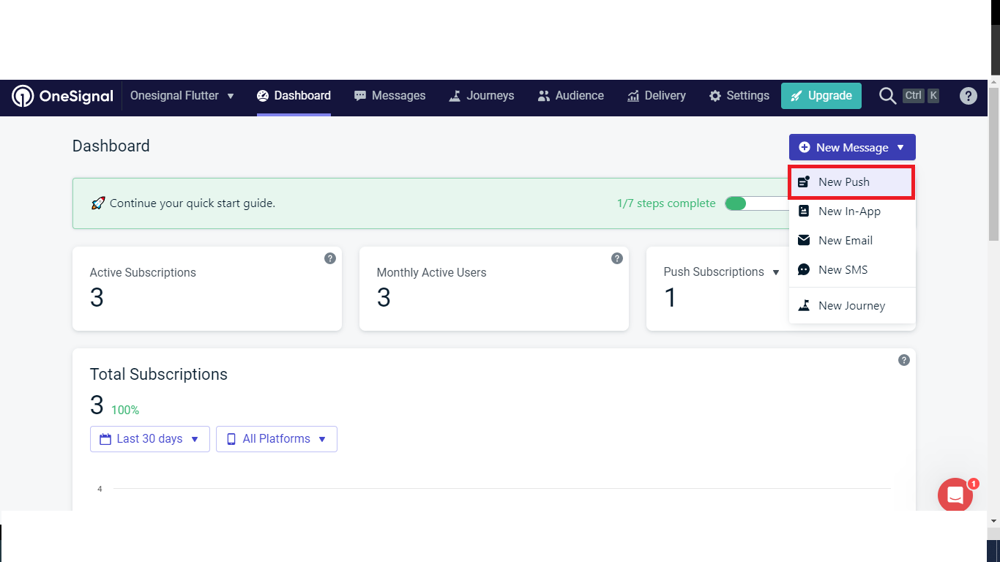
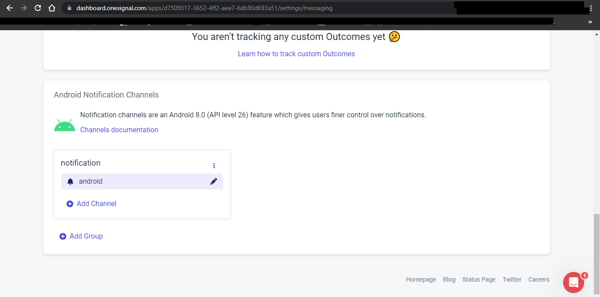

## 1. Research: OneSignal Flutter Package

- Keywords:
    - onesignal flutter
    - flutter onesignal notification
    - onesignal-flutter github
    - onesignal flutter web
    - onesignal flutter documentation
    - flutter onesignal notification sound
    - flutter one signal
    - onesignal flutter example
    - onesignal flutter tutorial
    - push notification sound download
    - onesignal background notification flutter
    - flutter onesignal push notification
    - onesignal notification not received when app is closed
    - flutter onesignal
    - onesignal documentation
    - flutter onesignal push notification
    - flutter onesignal background notification
- Video Title: OneSignal Flutter Tutorial - Flutter background notification and push/pop-up notification example

## 2. Research: Competitors

**Flutter Videos/Articles**

- 3.8K: https://www.youtube.com/watch?v=5klspCULQe4
- 5.8K: https://www.youtube.com/watch?v=YtDy2dVDVkM
- 1.9K: https://www.youtube.com/watch?v=J0G3avA2F-4
- 10K: https://www.youtube.com/watch?v=ZNpFs8Nfqbs
- 8.9K: https://www.youtube.com/watch?v=ZWAuBLckVdU
- 16K: https://www.youtube.com/watch?v=JueFyZTfESU
- 9.9K: https://www.youtube.com/watch?v=rOOSguiESSo
- https://pub.dev/packages/onesignal_flutter
- https://onesignal.com/blog/how-to-add-push-notifications-in-flutter-with-onesignal/
- https://medium.com/codechai/flutter-and-onesignal-notifications-22bbb706e025
- https://sites.google.com/view/geeky-traveller/app-development/flutter/flutter-and-onesignal-notifications
- https://medium.com/codechai/onesignal-notification-with-flutter-in-a-minute-3449fdf2c5f3
- https://dev.to/lordlamee/implementing-push-notifications-with-flutter-and-onesignal-part-1-3690

**Android/Swift/React Videos**

- 4.1K: https://www.youtube.com/watch?v=S2ubIsjdKgk
- 5.6K: https://www.youtube.com/watch?v=dVtTdyf0d_M
- 7.6K: https://www.youtube.com/watch?v=XFQHDt1C8Pc
- 37K: https://www.youtube.com/watch?v=Qcxa6dxfUFo
- 13K: https://www.youtube.com/watch?v=5ZPl6YnKyCE
- 3.1K: https://www.youtube.com/watch?v=RAOgAPnfJ-Y
- 9.1K: https://www.youtube.com/watch?v=po5_lB5-L4U
- 2.6K: https://www.youtube.com/watch?v=po5_lB5-L4U
- 17K: https://www.youtube.com/watch?v=tjuv3g_ZDEU
- 8.6K: https://www.youtube.com/watch?v=yKFM4xD2KHA
- https://documentation.onesignal.com/docs/react-native-sdk-setup
- https://blog.logrocket.com/implement-push-notifications-react-native-onesignal/
- https://medium.com/differential/react-native-push-notifications-with-onesignal-9db6a7d75e1e
- https://documentation.onesignal.com/docs/ios-sdk-setup
- https://onesignal.com/blog/how-to-add-push-notifications-into-an-ios-app/
- https://swiftpack.co/package/OneSignal/OneSignal-iOS-SDK
- https://documentation.onesignal.com/docs/android-sdk-setup
- https://onesignal.com/blog/how-to-add-push-notifications-to-an-android-app-with-java-and-kotlin/
- https://www.geeksforgeeks.org/push-notifications-in-android-using-onesignal/

**Great Features**
- OneSignal is a free push notification service for mobile apps. This plugin makes it easy to integrate your flutter app with OneSignal
- You can find more features at [https://pub.dev/packages/onesignal_flutter](https://pub.dev/packages/onesignal_flutter).

**Problems from Videos**
- Question: Can I send same notification to Android and iOS? And can I do without Firebase?
Answer: Yes, absolutely
- Question: how to change the notification default icon.?currently which is a bell icon
Answer: https://documentation.onesignal.com/docs/customize-notification-icons
- Question: How to show notification when app is terminated? We need native code to run background data process?
Answer: No, It works without the native code to run on the background process as it uses onesignal push service Implemented by the onesignal package.

**Problems from Flutter Stackoverflow**
- https://stackoverflow.com/questions/69185527/onesignal-doesnt-open-my-flutter-app-on-click-android-only
- https://stackoverflow.com/questions/70916028/flutter-onesignal-could-not-resolve-com-google-firebasefirebase-messaging
- https://stackoverflow.com/questions/71190509/flutter-one-signal-not-displaying-notifications
- https://stackoverflow.com/questions/69557100/flutter-named-parameter-and-onesignal-issue
- https://stackoverflow.com/questions/74755302/flutter-app-crashes-when-initialize-onesignal-on-android-13

## 3. Video Structure

**Main Points / Purpose Of Lesson**

1. OneSignal is a free email, sms, push notification, and in-app message service for mobile apps. This SDK makes it easy to integrate your Flutter iOS and/or Android apps with OneSignal.
2. Main Points
    - First, integrate firebase with your app.
    - Second, integrate your firebase app.
3. After integration with firebase and onesignal, you can send notification.

**The Structured Main Content**
1. Run `dart pub get onesignal_flutter` in your project's terminal to add in your project. Import `import 'package:onesignal_flutter/onesignal_flutter.dart';` where you want to use it.
2. For this video
- There is no need to setup anything for Android and iOS.
- Watch [this](https://www.youtube.com/watch?v=sz4slPFwEvs) video to integrate firebase with flutter or watch this [video](https://youtu.be/EXp0gq9kGxI) on [Add Firebase to your Flutter app](https://firebase.google.com/docs/flutter/setup?platform=android).
- Go to `Project settings` and under `Cloud Messaging` tab, enable `Cloud Messaging API (Legacy)`.

Then provide `Firebase Server Key` and `Firebase Sender ID` from firebase `Project settings` and under `Cloud Messaging` tab.

After providing these details, you will receive `appId` in string format. Copy and save the `appId`.
- In `main.dart` file, you just need to call `OneSignal.shared.setAppId(oneSignalAppId);` in the `initState()` method of your stateful widget.
```dart
  final oneSignalAppId = 'your-AppId';
  @override
  void initState() {
    super.initState();
    // OneSignal.shared.setLogLevel(OSLogLevel.debug, OSLogLevel.none);
    OneSignal.shared.setAppId(oneSignalAppId);
  }
```
- When the app is running, go to `Messages` tab, click on `New Message`, and then click on `New Push` to create and send the new push notification.

Notification also shows when app is running in background or completely killed.
  - Notifications according to above process shows as silent notification. Although it has tone, but it does not show pop up as like normal notifications have. It shows only in list of notifications when it is received.
<br />To show pop up when notification is received, you can check this documentation: [Android Notification Categories](https://documentation.onesignal.com/docs/android-notification-categories). This documentation says that in your `OneSignal Dashboard`, go to `Settings > Messaging > Android Notification Channels`.
<br />
Then click `Add Group` and `Add Channel` under the newly created group. These names will be visible to the user when they view the notification settings for your app on the device.
<br />
<br />Enter the category name, description, and any defaults the device will use for notifications sent with this category. When finished, click "Create Category". Set the `Importance` to `URGENT -> It makes sound and pops up on screen.`
<br />
<br />Now, while sending the notification, choose the `Category` of the name which you created for `Urgent` priority in `2. Message` step. Then send the notification. It will pop up in user device.
<br />